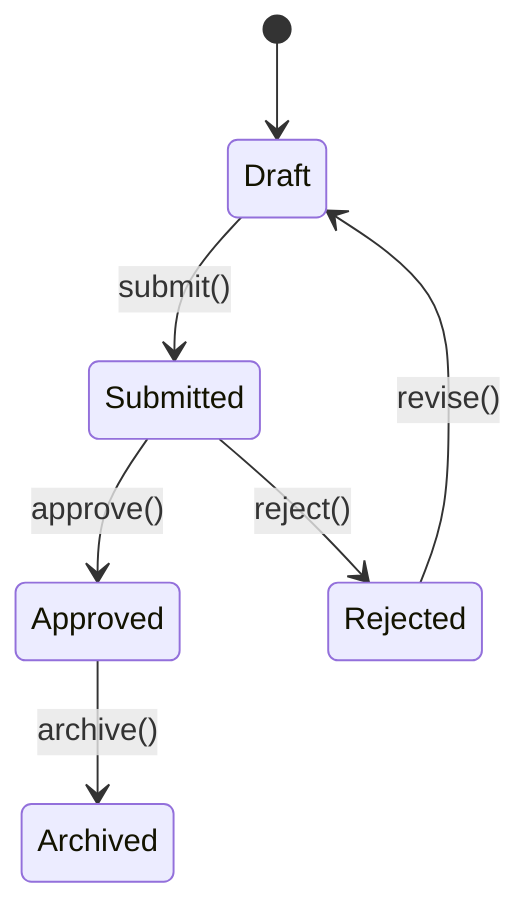

# Finite State Machines & BPM Modeling

Complex multi-step processes, lifecycle states, and transaction workflows must be modeled as deterministic Finite State Machines (FSM) following Business Process Management (BPM) principles.

## 🧭 Core Directives

### 1. Deterministic State Transitions
- Never represent complex entity lifecycles with scattered boolean flags (e.g. `isPending`, `isVerified`, `isCancelled`).
- Declare an explicit set of discrete states (e.g. `draft`, `submitted`, `approved`, `archived`) and valid transition paths.



### 2. State Machine Libraries (`@quatrain/state-machine`, `shulk`)
- Leverage standardized state machine utilities to validate transitions before state changes are persisted.
- Invalid state transitions must throw explicit domain exceptions:
  ```typescript
  if (!orderFSM.canTransitionTo('shipped')) {
    throw new InvalidStateTransitionError(orderFSM.currentState, 'shipped');
  }
  ```

### 3. Separation of State Logic & Side Effects
- Transition handlers must decide whether a transition is allowed based solely on state and input.
- Side effects (sending emails, publishing events, logging) must be triggered asynchronously via post-transition hooks or domain event listeners.

## 🔗 Related Units
- [Queue & Event Streaming](queue-and-event-streaming.md)
- [Quatrain Repository Pattern](../backend-workers/quatrain-repository-pattern.md)
