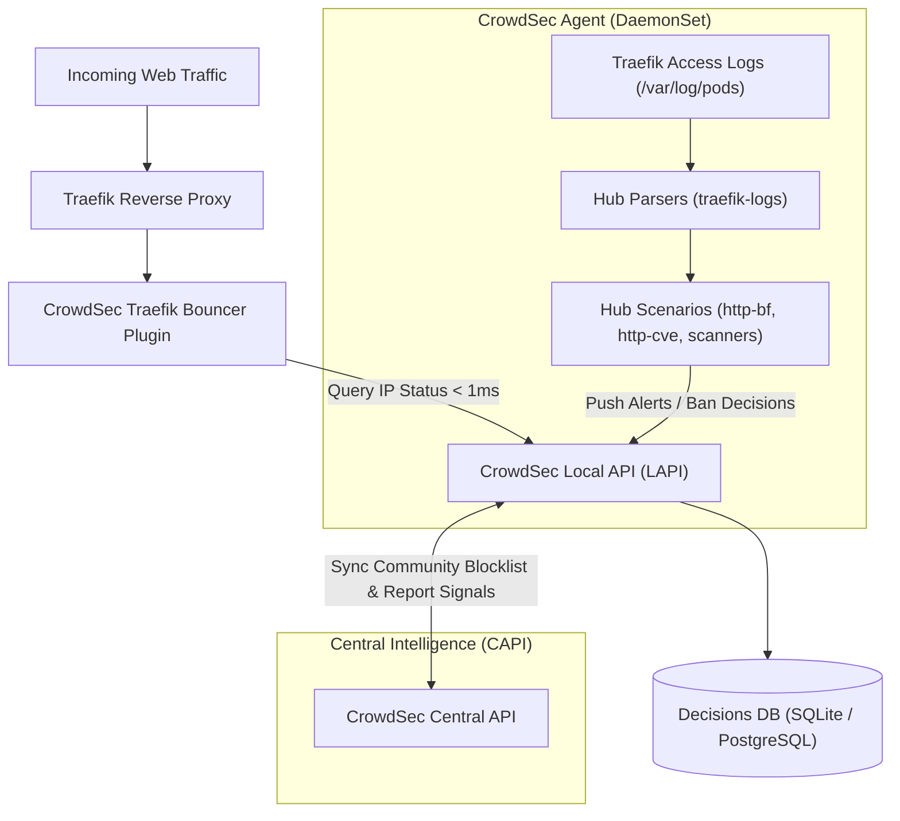

# CrowdSec Architecture, Deployment & Traefik Bouncer Standards

**CrowdSec** is an open-source, collaborative cyberdefense engine designed to protect modern cloud-native infrastructures against application attacks, brute-force attempts, scrapers, automated scanners, and distributed denial-of-service (DDoS) threats.

Unlike traditional static tools (such as `fail2ban`), CrowdSec decouples **detection** (log parsing & behavioral scenarios) from **remediation** (bouncers) through a centralized Local API (LAPI) and leverages a global community consensus network.

---

## 🧭 1. Architecture Overview



### Core Architecture Pillars:
1. **Agent / Parser DaemonSet:** Scans container logs (`program: traefik`) using declarative Hub scenarios to spot malicious behaviors in real time.
2. **Local API (LAPI):** Centralized decision coordinator within the cluster. Evaluates detections, enforces retention policies, and serves active decisions to bouncers.
3. **Remediation Bouncers:** Lightweight enforcement plugins running directly at ingress entrypoints (Traefik, NGINX, Cloudflare, Firewall).
4. **Central API (CAPI):** Collaborative threat intelligence network sharing aggregated, anonymized malicious IPs across hundreds of thousands of participating servers worldwide.

---

## ⚙️ 2. Traefik Ingress Bouncer Integration

In Kubernetes deployments, Traefik utilizes the official Go plugin [`crowdsec-bouncer-traefik-plugin`](https://github.com/maxlerebourg/crowdsec-bouncer-traefik-plugin).

### Operational Modes:
* **`live` mode (Default & Recommended):** Traefik queries the LAPI for incoming client IPs with an internal high-speed memory cache (e.g. 60s TTL). Bans take effect immediately across all Traefik pods without waiting for polling cycles.
* **`stream` mode:** Traefik periodically pulls the complete list of active decisions into memory. Zero query latency, but higher memory footprint on high decision volumes.

### Standard Traefik Middleware Definition:
```yaml
apiVersion: traefik.io/v1alpha1
kind: Middleware
metadata:
  name: crowdsec-bouncer
  namespace: traefik
spec:
  plugin:
    crowdsec-bouncer:
      enabled: true
      logLevel: "INFO"
      crowdsecMode: "live"
      crowdsecLapiScheme: "http"
      crowdsecLapiHost: "crowdsec-service.crowdsec.svc.cluster.local:8080"
      crowdsecLapiKey: "change-me-to-a-secure-random-key"
      banStatusCode: 403
      banMsg: "Access Denied by Security Policy"
      # Exempt internal cluster & private VPC subnets from banning
      whitelist:
        - "10.0.0.0/8"
        - "172.16.0.0/12"
        - "192.168.0.0/16"
        - "127.0.0.1/32"
```

---

## 🔍 3. Dry-Run & Observation Mode (Simulation)

To prevent false positives and audit traffic impact prior to active enforcement, CrowdSec provides native **Simulation Mode**.

### How Simulation Works:
* Scenarios detect threats normally and log alert events into metrics and Loki.
* Remediation decisions are marked as **`(simul)ban`** instead of `ban`.
* **No IP addresses are blocked.** Valid traffic and legitimate users are completely unimpacted.

### Configuration via Helm `values.yml`:
```yaml
config:
  simulation.yaml: |
    simulation: true  # Set to true for observation only, false for active blocking
```

### Dynamic Simulation Management (`cscli`):
```bash
# Check current simulation state
cscli simulation status

# Enable global simulation (observation mode)
cscli simulation enable --global

# Disable simulation and switch to active blocking
cscli simulation disable --global
```

### Traefik Middleware Dry-Run Mode:
In addition to CrowdSec engine simulation, the Traefik middleware can be set to shadow mode:
* `enabled: false`: Traefik evaluates and logs decision verdicts with `logLevel: "DEBUG"` without halting requests.

---

## 🛠️ 4. Essential Operational Commands (`cscli`)

All operational management is handled via the `cscli` CLI tool inside the `crowdsec-lapi` pod:

```bash
# Shortcut helper:
alias k-cs="kubectl exec -it -n crowdsec deploy/crowdsec-lapi -- cscli"
```

| Task | Command | Description |
| :--- | :--- | :--- |
| **Inspect Active Bans** | `cscli decisions list` | Display currently active IP bans, duration, and origin scenario |
| **Inspect Recent Alerts** | `cscli alerts list` | Show triggered security alerts and attack details |
| **Audit Bouncers** | `cscli bouncers list` | Verify that Traefik bouncers are healthy and polling LAPI |
| **Unban an IP Manually** | `cscli decisions delete --ip <IP>` | Immediately remove an IP ban (in case of false positive) |
| **Manually Ban an Attacker** | `cscli decisions add --ip <IP> --duration 4h --reason "Manual ban"` | Block an aggressive IP immediately |
| **Manage Hub Scenarios** | `cscli hub list` / `cscli collections install ...` | List or install threat detection collections |
| **Engine Metrics** | `cscli metrics` | Display parser processing rates, drops, and decision statistics |

---

## 🛑 5. Safety Protocols for Pentests & Validation

> [!CAUTION]
> **Mandatory External VPN Rule:**  
> When testing rate-limiting, scanner blocking, or simulating attacks against Traefik Ingress:
> - **NEVER** use the local developer workstation or office network IP address.
> - **ALWAYS** route test traffic through a disposable external VPN tunnel.
> - Banning the local IP will sever team access to Git remotes, Kubernetes APIs, and internal services.
> - 👉 *See full protocol:* [Security Testing, Pentesting & Rate-Limit Validation Protocol](pentesting-and-security-validation.md)

---

## 🔗 Related Units
- [Security Testing & Pentesting Protocol](pentesting-and-security-validation.md)
- [Operational Permissions Matrix](../infrastructure/operational-permissions-matrix.md)
- [Multi-Cloud K8s & Terraform IaC](../infrastructure/k8s-multi-cloud-iac.md)
