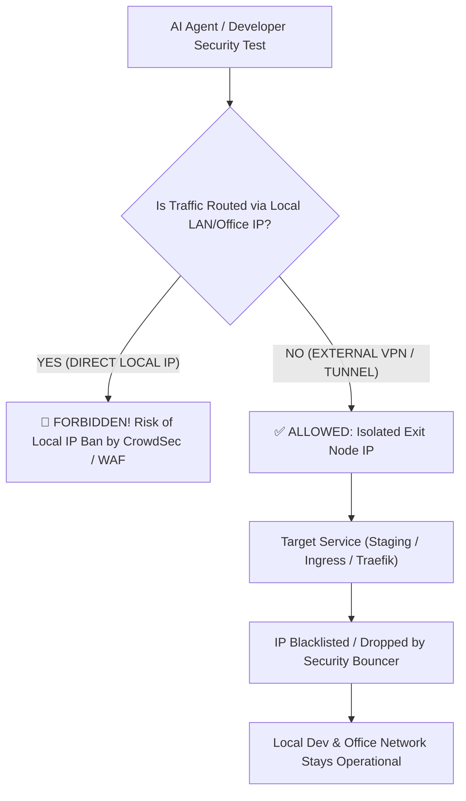

# Security Testing, Pentesting & Rate-Limit Validation Protocol

When performing penetration testing (*pentests*), automated vulnerability scanning, HTTP flood/DDoS load tests, brute-force attack simulations, or HTTP middleware validation (such as verifying rate-limiters, Traefik bouncers, or CrowdSec bans), strict network hygiene is mandatory to prevent accidental self-denial of service.

---

## 🧭 Core Directives

### 1. Absolute Prohibition of Local LAN / Developer IP
- **Zero Local IP Exposure:** NEVER execute pentesting tools (`nmap`, `zap`, `nikto`, `sqlmap`), automated load generators (`k6`, `wrk`, `hey`, `ab`), or brute-force scripts using the local network IP address (home, office, or developer workstation).
- **Catastrophic Consequence:** Triggering reactive intrusion prevention systems (CrowdSec, `fail2ban`, Cloudflare WAF, cloud provider DDoS mitigations) from a local IP will instantly ban the entire office/home network. This paralyzes SSH, Git pushes, Kubernetes control planes, and internal communications for the entire team.

### 2. Mandatory External VPN Routing
- **Enforced VPN / Proxy Layer:** All penetration testing, attack simulation, and security validation traffic **MUST be strictly routed through an external VPN** or disposable external test runner (e.g. dedicated cloud VM, isolated container proxy, or commercial VPN exit node).
- **Disposable Exit Nodes:** If an exit node IP is blacklisted or dropped during validation (proving that the security middleware works as expected), rotate the VPN connection or destroy the disposable runner without impacting primary development operations.

### 3. Pre-Test Notification & Whitelisting Protocol
- **Staging / Sandbox Exclusivity:** Destructive or high-volume pentests must only target designated Staging or ephemeral test clusters.
- **Coordination:** Before initiating sustained penetration scans against shared environments, coordinate with the infrastructure lead to verify that monitoring alerts (Loki/Grafana) are observed without triggering unwanted automated provider escalation.

---

## 🔗 Related Units
- [Operational Permissions Matrix](../infrastructure/operational-permissions-matrix.md)
- [Multi-Cloud K8s & Terraform IaC (Tycho Standards)](../infrastructure/k8s-multi-cloud-iac.md)
