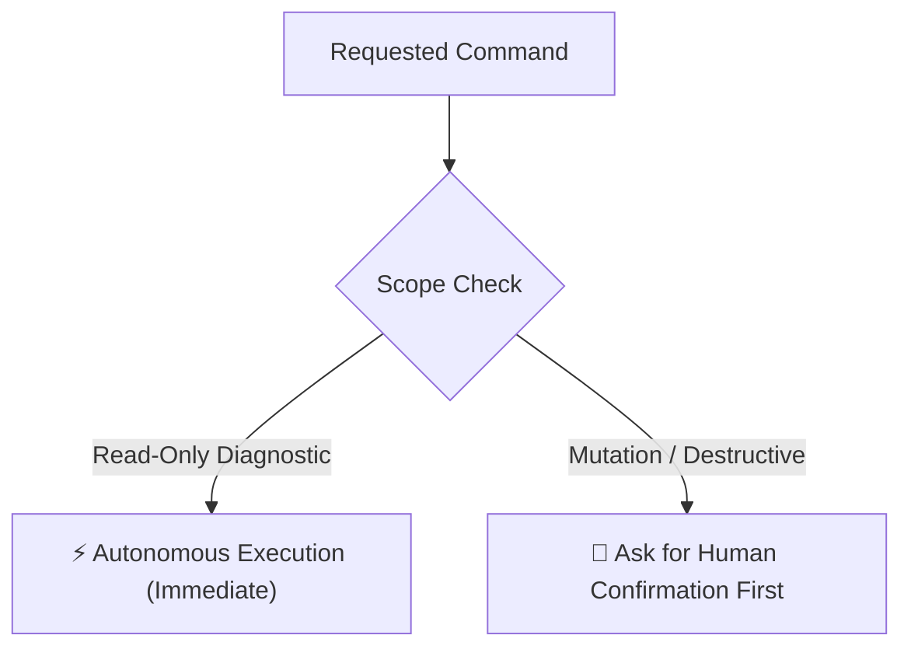

# Operational Permissions Matrix (Autonomous vs Gated Actions)

To maintain maximum development velocity without risking production outages or unintended data loss, AI agent operations are strictly partitioned into two operational scopes.

## ⚡ 1. Autonomous Scope (Read-Only — Immediate Execution)
The AI agent is fully authorized to proactively run the following read-only commands without interrupting the user:

### Kubernetes Inspection
- `kubectl get <pods|svc|deployments|ingresses|pvc> -n <namespace>`
- `kubectl describe <pod|svc|deployment> -n <namespace>`
- `kubectl logs <pod-name> -n <namespace> [--tail=N]`
- `kubectl top <pods|nodes>`

### GitHub CLI Inspection
- `gh issue list`, `gh issue view <number>`
- `gh pr list`, `gh pr view <number>`, `gh pr diff <number>`
- `gh run list`, `gh run view <run-id> [--log]`
- `gh release list`, `gh release view`

### Local Diagnostics & Health Checks
- Running read-only SQL queries or health inspection scripts.
- Checking Git status (`git status`, `git log`, `git diff`).
- Inspecting local Docker/Podman container status (`podman ps`, `docker compose ps`).

---

## 🛑 2. Gated Scope (Confirmation Required Before Execution)
The AI agent **MUST STOP and request explicit human confirmation** before executing any of the following operations:

1. **Database Mutations**:
   - Running `UPDATE`, `DELETE`, `TRUNCATE`, `DROP TABLE`, or destructive schema alterations on non-test databases.
2. **Cluster & Infrastructure Modifications**:
   - `kubectl delete <pod|pvc|deployment|service|namespace>`
   - `kubectl apply` or `kubectl patch` targeting production or staging clusters.
   - `kubectl scale` modifying replica counts in production environments.
3. **Git History & Remote Modifications**:
   - Force pushing (`git push --force`).
   - Merging Pull Requests (merges are reserved for human review).
   - Deleting remote branches or tags.

## 🔗 Related Units
- [GitHub CLI Protocol](/workflow/github-cli-protocol.md)
- [Kubernetes Manifests & Deployments](/infrastructure/k8s-manifests-and-deployments.md)
