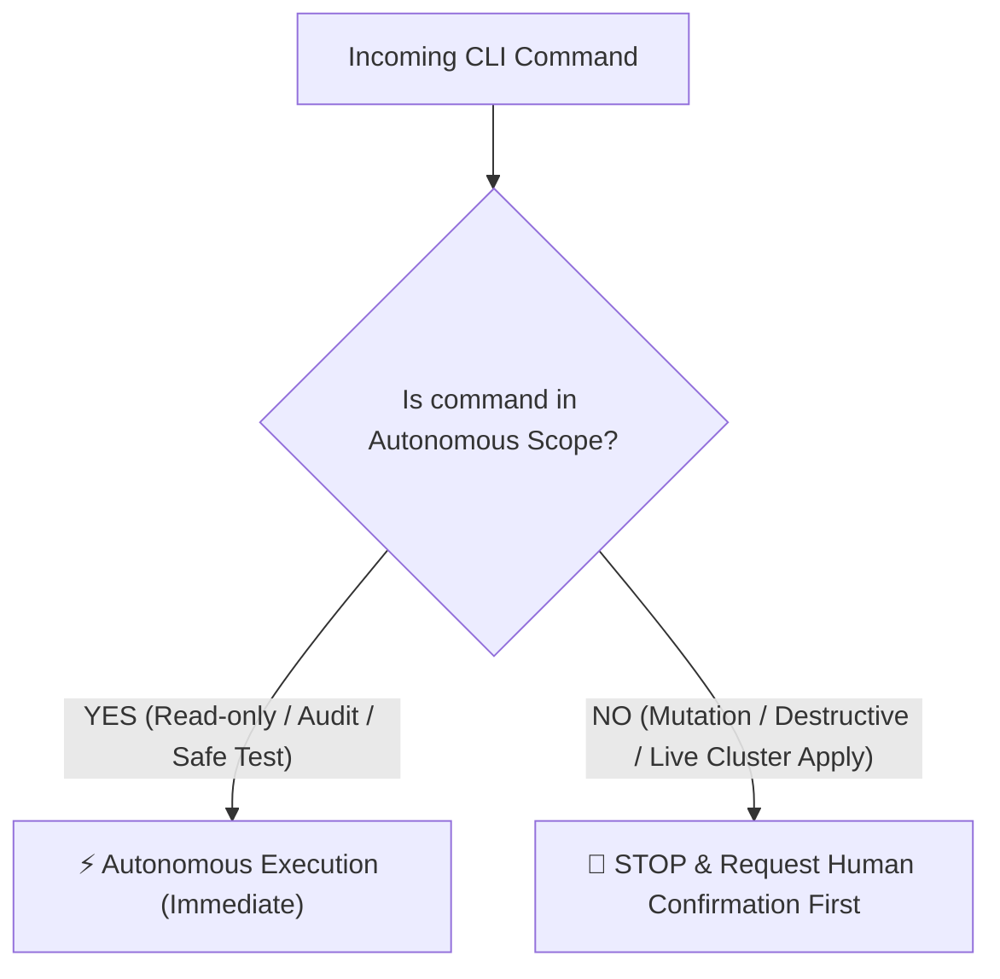

# Operational Permissions Matrix (Autonomous vs Gated Actions)

To maximize developer and AI agent velocity while eliminating risks of production incidents, accidental data corruption, or secret leakage, commands are strictly divided into **Autonomous Scope** (executed immediately without asking) and **Gated Scope** (strictly requiring explicit human confirmation).

---

## ⚡ 1. Autonomous Scope (Authorized by Default — No Confirmation Required)

The agent is fully authorized to run any of the following non-destructive inspection, audit, diagnostic, and local build/test commands.

### A. Standard UNIX / Shell Utilities (Filesystem, System & Network Audit)

| Tool | Authorized Commands & Safe Flags | Scope & Purpose |
| :--- | :--- | :--- |
| **`ls`** | `ls`, `ls -l`, `ls -la`, `ls -lh`, `ls -R`, `ls -t` | Directory listings, timestamps, file sizes |
| **`cat`**, **`head`**, **`tail`** | `cat <file>`, `head -n <N>`, `tail -n <N>`, `tail -f` | Viewing file content, inspecting log streams |
| **`grep`**, **`rg`** | `grep [-r | -i | -n | -v | -E]`, `rg [-i | -l | -g | -C]` | Text pattern searches, keyword scanning |
| **`find`** | `find <dir> -type f/d [-name \| -iname \| -maxdepth \| -prune]` | Filesystem tree searches and file discovery |
| **`tree`** | `tree [-L <N>] [-a] [-I <pattern>]` | Visual directory hierarchy inspection |
| **`diff`**, **`cmp`** | `diff [-u | -r | -w] <file1> <file2>` | File and directory comparison |
| **`stat`**, **`file`**, **`wc`** | `stat <file>`, `file <file>`, `wc [-l | -w | -c]` | Metadata, MIME type check, line counts |
| **`du`**, **`df`** | `du -sh <dir>`, `df -h` | Disk usage and partition capacity audit |
| **`ps`**, **`top`**, **`htop`** | `ps aux`, `ps -ef`, `top -l 1`, `pgrep` | Process table and resource consumption check |
| **`lsof`**, **`netstat`**, **`ss`** | `lsof -i :<port>`, `netstat -tuln`, `ss -tulpn` | Active network listeners and socket audit |
| **`pwd`**, **`which`**, **`env`** | `pwd`, `which <binary>`, `env` (read-only) | Environment context, binary path resolution |
| **`jq`**, **`yq`** | `jq '.'`, `jq '<query>' <file>`, `yq '<query>'` | Parsing and filtering JSON and YAML files |
| **`curl`** (Read-Only) | `curl -I <url>`, `curl -s <url>`, `curl -v -X GET <url>` | HTTP header checks, health probes, GET queries |

### B. Git Operations (Read-Only & Local Validation)

| Command | Authorized Flags & Subcommands | Scope & Purpose |
| :--- | :--- | :--- |
| **`git status`** | `git status`, `git status -s` | Inspect working directory and staging area |
| **`git log`** | `git log`, `git log -n <N>`, `git log --oneline --graph` | Inspect commit history and ancestry |
| **`git diff`** | `git diff`, `git diff --staged`, `git diff <branch>` | Review unstaged and staged code modifications |
| **`git branch`** | `git branch`, `git branch -a`, `git branch -r` | List local and remote branches |
| **`git remote`** | `git remote -v`, `git remote show <origin>` | Inspect configured remotes and URLs |
| **`git show`** | `git show <commit>`, `git show <tag>` | Inspect commit diffs and tag metadata |
| **`git tag`** | `git tag`, `git tag -l "<pattern>"` | List existing SemVer and release tags |

### C. GitHub CLI (`gh`)

| Subcommand | Authorized Flags & Invocations | Scope & Purpose |
| :--- | :--- | :--- |
| **`gh issue`** | `gh issue list`, `gh issue view <num>`, `gh issue status` | Audit open/closed issues, assignees, milestones |
| **`gh pr`** (Read) | `gh pr list`, `gh pr view <num>`, `gh pr diff <num>`, `gh pr checks <num>`, `gh pr status` | Review pull requests, code diffs, CI status checks |
| **`gh run`** | `gh run list [--limit N]`, `gh run view <id> [--log]`, `gh run watch <id>` | Monitor GitHub Actions workflow executions |
| **`gh release`** | `gh release list`, `gh release view [<tag>]` | Audit published releases and download assets |
| **`gh repo`** | `gh repo view [<repo>]`, `gh repo list <org>` | Inspect repository settings and default branches |
| **`gh auth`** | `gh auth status` | Verify authenticated user and token scopes |
| **`gh gist`** (Read) | `gh gist list`, `gh gist view <id>` | Inspect Gist content and revision history |

### D. Kubernetes (`kubectl`, `kns`, `ktx`)

| Resource Inspection | Authorized Commands & Safe Flags | Scope & Purpose |
| :--- | :--- | :--- |
| **`kubectl get`** | `kubectl get <pods\|svc\|deploy\|ingress\|pvc\|nodes\|cm\|secrets\|all>` (`-n <ns>`, `-A`, `-o wide`, `-o yaml`, `-o json`) | Audit cluster workload status and definitions |
| **`kubectl describe`**| `kubectl describe <resource> <name> [-n <ns>]` | Inspect events, pod lifecycle, crash reasons |
| **`kubectl logs`** | `kubectl logs <pod> [-n <ns>] [--tail=N] [-f] [-c <container>]` | Inspect runtime application logs and stack traces |
| **`kubectl top`** | `kubectl top pods [-n <ns>]`, `kubectl top nodes` | Monitor live CPU and memory utilization |
| **`kubectl kustomize`**| `kubectl kustomize <dir>` | Render and validate Kustomize overlays locally |
| **`kubectl cluster-info`**| `kubectl cluster-info`, `kubectl version` | Check control plane address and version |

### E. Containers & Orchestration (`podman`, `docker`, `docker compose`)

| Tool | Authorized Commands & Safe Flags | Scope & Purpose |
| :--- | :--- | :--- |
| **`podman ps`** / **`docker ps`** | `podman ps`, `podman ps -a`, `docker ps`, `docker ps -a` | List running and stopped container instances |
| **`podman images`** / **`docker images`** | `podman images`, `docker images` | Audit local container images and layer sizes |
| **`podman logs`** / **`docker logs`** | `podman logs [--tail=N] [-f] <id>`, `docker logs ...` | Read container stdout/stderr output streams |
| **`podman inspect`** / **`docker inspect`** | `podman inspect <id>`, `docker inspect <id>` | Inspect IP addresses, volume mounts, env vars |
| **`podman top`** / **`docker top`** | `podman top <id>`, `docker top <id>` | Check active processes inside running container |
| **`podman stats`** / **`docker stats`** | `podman stats --no-stream`, `docker stats --no-stream` | Snapshot container CPU, memory, network I/O |
| **`docker compose`** / **`podman compose`** | `docker compose ps`, `docker compose logs`, `docker compose config` | Verify multi-service Compose syntax and logs |

### F. Infrastructure as Code (`terraform`, `tofu`)

| Tool | Authorized Commands & Safe Flags | Scope & Purpose |
| :--- | :--- | :--- |
| **`terraform fmt`** | `terraform fmt -check -recursive` | Verify HCL formatting standards |
| **`terraform validate`** | `terraform validate` | Validate configuration syntax and variables |
| **`terraform plan`** | `terraform plan [-var-file=...]` (without -apply) | Dry-run execution plan generation |
| **`terraform show`** | `terraform show`, `terraform state list`, `terraform state show <resource>` | Inspect state file resources without mutations |

### G. Local Build, Typecheck, Lint & Test Runners

| Ecosystem | Authorized Commands | Scope & Purpose |
| :--- | :--- | :--- |
| **Bun** | `bun test`, `bun run build`, `bun run validate`, `bun run lint` | Run local unit test suites, compile bundles, lint |
| **Node / Yarn / NPM** | `yarn test`, `yarn lint`, `yarn why <pkg>`, `yarn workspaces list`, `npm test`, `npm list` | Test runner, workspace graph audit, dependency tree |
| **TypeScript** | `tsc --noEmit`, `npx tsc -p tsconfig.json` | Typecheck codebase for zero TS compilation errors |
| **Python / Poetry** | `poetry run pytest`, `poetry show`, `poetry check` | Run unit tests and audit installed virtualenv packages |
| **Rust / Cargo** | `cargo check`, `cargo test`, `cargo clippy` | Typecheck, test runner, lint analysis |

### H. Git Local Write Operations (Autonomous — Local Repository Only)

These operations modify only the **local git state** and do not push to any remote. They are authorized by default for autonomous execution.

| Command | Authorized Scope & Purpose |
| :--- | :--- |
| `git add <files>` | Stage tracked and untracked files for commit |
| `git commit -m "<conventional-msg>"` | Create atomic conventional commits locally |
| `git checkout -b <branch>` | Create and switch to a new feature/fix branch from `develop` |
| `git checkout <existing-branch>` | Switch between local branches |
| `git stash` / `git stash pop` | Temporarily shelve and restore uncommitted work |
| `git stash list` / `git stash show` | Inspect stash stack contents |
| `git cherry-pick <sha>` | Apply a specific commit locally (not targeting `main`) |
| `git reset --soft HEAD~1` | Undo last commit while keeping changes staged (local only) |
| `git rebase -i` (local) | Interactive rebase on local-only branches (never on pushed branches) |

> [!IMPORTANT]
> **Never push** without explicit human approval when targeting `main`. Pushing to `develop` feature branches is autonomous. Force-push (`--force`) to any remote branch requires explicit confirmation.

---

## 🛑 2. Gated Scope (Confirmation Strictly Required Before Execution)

The agent **MUST STOP and request explicit human confirmation** before executing any of the following creative, destructive, modifying, or live production operations:

### 1. Database Operations
- Executing `UPDATE`, `DELETE`, `TRUNCATE`, `DROP TABLE`, `ALTER TABLE`, or destructive schema migrations directly against live staging or production databases.
- Overwriting production database dumps or restores.

### 2. Live Cluster & Infrastructure Mutations
- `kubectl delete <pod|deployment|service|ingress|pvc|namespace>`
- `kubectl apply`, `kubectl patch`, or `kubectl create` targeting production or staging clusters outside local dry-run / sandbox environments.
- `kubectl scale` modifying replica counts in live production.
- `terraform apply` or `tofu apply` modifying real cloud resources.

### 3. Container Lifecycle Mutations
- `podman rm -f`, `docker rm -f`, `podman rmi -f`, `docker rmi -f`
- `docker system prune -a --volumes` (destructive wiping of volumes or images)

### 4. Git & Release Actions
- Force pushing (`git push --force` or `git push -f`).
- **Merging Pull Requests**: Merging PRs into `develop` or `main` remains exclusively under human discretion.
- Deleting remote branches or remote tags (`git push origin --delete <branch|tag>`).

### 5. Penetration Testing & Attack Simulations
- **Mandatory VPN Requirement:** NEVER execute pentests, vulnerability scanning, load/DDoS stress testing, or brute-force validation using the local office or developer network IP address.
- **Dedicated Tunnel / VPN:** All penetration and security validation traffic MUST be routed through a designated external VPN or disposable test runner to prevent catastrophic IP bans from CrowdSec, fail2ban, or cloud WAFs from blacklisting the local infrastructure.
- 👉 *See full protocol:* [Security Testing, Pentesting & Rate-Limit Validation Protocol](../cybersecurity/pentesting-and-security-validation.md)

---

## 🔗 Related Units
- [GitHub CLI Protocol](../workflow/github-cli-protocol.md)
- [Kubernetes Manifests & Deployments](k8s-manifests-and-deployments.md)
- [Multi-Cloud K8s & Terraform IaC](k8s-multi-cloud-iac.md)
- [Security Testing & Pentesting Protocol](../cybersecurity/pentesting-and-security-validation.md)

