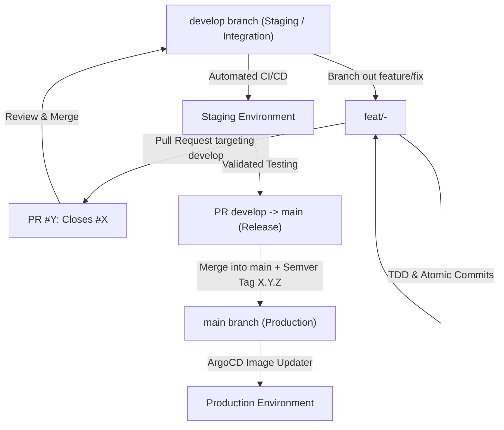

# Standard Feature & Release Lifecycle (GitFlow Protocol)

All projects follow a structured GitFlow lifecycle inherited from enterprise deployments.



## 🧭 Step-by-Step Lifecycle

### Step 1: Issue Creation & Specifications
- Every coding task begins with a dedicated GitHub Issue:
  ```bash
  gh issue create --title "<type>: <short-description>" --body "..."
  ```
- For architectural changes or major refactoring, write a technical specification under `docs/tickets/` or `docs/architecture/`.

### Step 2: Dedicated Branch from `develop`
- Feature and bugfix branches **MUST** branch out strictly from `develop`:
  ```bash
  git checkout develop && git pull origin develop
  git checkout -b feat/<issue-number>-<short-description>
  # or fix/<issue-number>-<short-description>
  ```

### Step 3: TDD, Verification & Atomic Commits
- Implement the solution test-first with co-located unit tests.
- Ensure all tests pass (`bun test` or `yarn test`), TypeScript compiles cleanly (`tsc`), and linters succeed.
- Create atomic, descriptive conventional commits.

### Step 4: Pull Request targeting `develop` (Staging)
- Open a GitHub PR targeting `develop`:
  ```bash
  gh pr create --base develop --head feat/<branch> --assignee @me --title "..." --body "Closes #<issue-number>"
  ```
- Merging into `develop` automatically deploys the Staging environment.

### Step 5: Production Release (`develop` $\to$ `main` + Tag)
- Once staging verification is complete, open a formal release PR from `develop` to `main`.
- Bump versions in `package.json`.
- Merge into `main`, then create and push an annotated SemVer tag.

## 🔗 Related Units
- [Branch Isolation & Topic Switch](branch-isolation-and-topic-switch.md)
- [Conventional Commits Protocol](conventional-commits.md)
- [GitHub CLI Protocol](github-cli-protocol.md)
- [SemVer & Monorepo Tagging](semver-and-monorepo-tagging.md)
