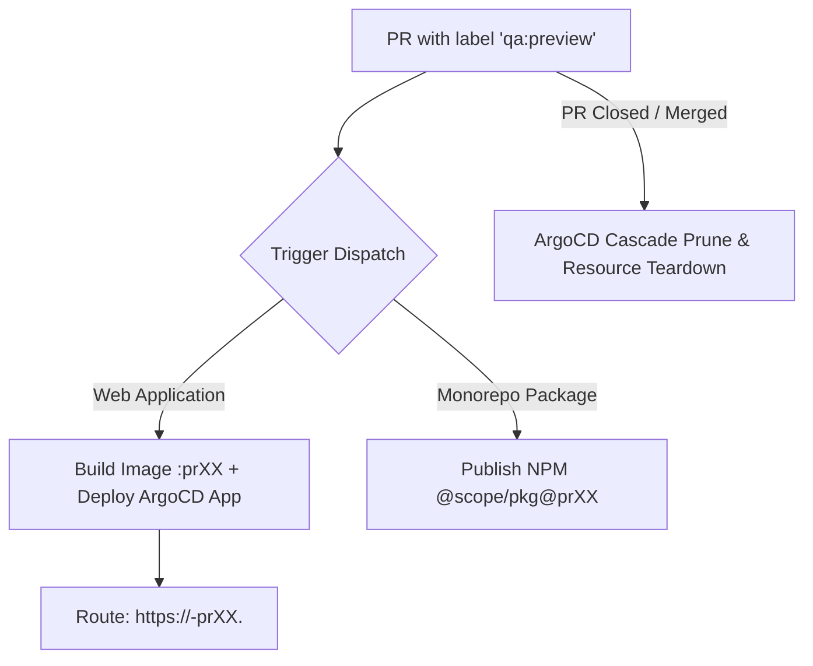

# On-Demand QA Preview Environments (`qa:preview`)

For non-trivial features requiring comprehensive QA validation prior to merge into `develop`, apply the GitHub label `qa:preview` to the Pull Request.

## 🧭 Operational Architecture

Applying `qa:preview` leverages shared composite GitHub Actions (e.g. from `Quatrain/actions`) to provision isolated preview assets.



### 1. Web Applications & Services
- **Automated Deployment:** Builds a multi-arch container image tagged `:prXX` and provisions an ephemeral ArgoCD application routed to `https://<app>-prXX.<domain>` (e.g. `studio-pr25.apps.quatrain.dev`).
- **Live Staging Comment:** Posts a sticky comment directly on the PR with the live URL. Automatically updates upon subsequent pushes to the feature branch.
- **Automated Teardown:** When the PR is closed (whether merged or closed without merge), the cleanup action automatically deletes the ArgoCD application and cascade-prunes all associated Kubernetes pods, services, ingresses, and TLS certificates.

### 2. Monorepo Packages
- Publishes the changed packages to NPM and GitHub Packages with version suffix `-prXX` and dist-tag `prXX`.
- Posts an installation snippet directly to the PR:
  ```bash
  yarn add @quatrain/core@pr25
  ```

## 🔗 Related Units
- [GitHub CLI Protocol](github-cli-protocol.md)
- [ArgoCD GitOps & Image Updater](../infrastructure/argocd-gitops-and-updater.md)
