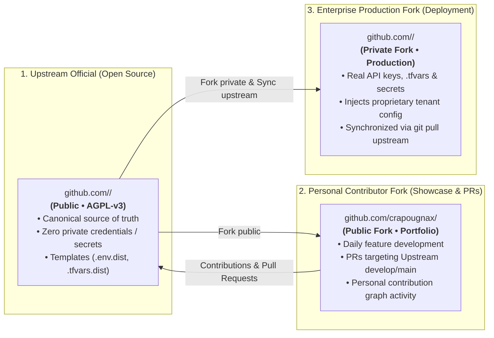

# Three-Tier Forking Model for Open Source & Enterprise

For community-facing and open-source ecosystems (such as Tycho, shared multi-cloud recipes, and core packages), development follows a structured **3-Tier Forking Architecture**.



## 🧭 Tier Breakdown

### 1. The Upstream Repository (`<org>/<repo>`)
- Hosted under the official community organization (e.g. `tycho-ops`, `Quatrain`).
- 100% public, cloud-agnostic, and governed by **AGPL-v3**.
- Strictly zero hardcoded secrets. Maintained with `.env.dist` and `terraform.tfvars.dist`.
- Protected by automated GitHub Actions quality gates.

### 2. The Personal Contributor Fork (`crapougnax/<repo>`)
- Public fork hosted under the personal developer account.
- Daily feature development and bug fixing take place here.
- Contributions merge upstream via standard Pull Requests, demonstrating open-source leadership and populating the personal GitHub contribution graph.
- Configured with standard remotes:
  ```bash
  origin    https://github.com/crapougnax/<repo>.git (fetch & push)
  upstream  https://github.com/<org>/<repo>.git      (fetch & push)
  ```

### 3. The Enterprise Production Fork (`<org>/<repo>`)
- Private organization fork used exclusively for production deployment and tenancy operations.
- Injects real production credentials, Scaleway/AWS tokens, and tenant configurations.
- Upstream improvements and bug fixes are pulled cleanly via:
  ```bash
  git pull upstream main
  ```

## 🔗 Related Units
- [GitFlow Protocol](gitflow-protocol.md)
- [GitHub CLI Protocol](github-cli-protocol.md)
